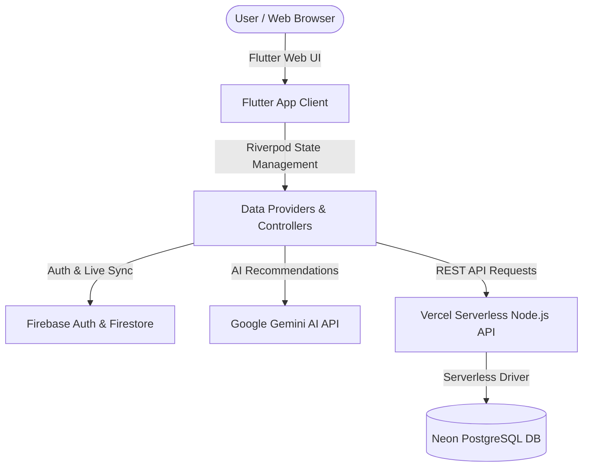

# FitPulse • AI Fitness & Workout Analytics Engine

[](https://fitness-tracker-app-five.vercel.app/)
[](https://github.com/krushna9506/fitness_tracker)
[](https://flutter.dev)
[](https://riverpod.dev)
[](LICENSE)
[](#)

> A production-grade, cross-platform health & fitness tracking application featuring Google Gemini AI workout recommendations, dual-database sync (Firebase Firestore + Neon PostgreSQL), dynamic chart analytics, and modern clean architecture. Built with Flutter, Riverpod, and Vercel Serverless.

---

## 📌 Project Overview

**Fitness Tracker App** is a modern, responsive full-stack health and fitness tracking platform designed and engineered as an **Internship Showcase Project**. 

The application enables users to set personal health goals, track daily workout sessions, monitor caloric expenditure, visualize progress via interactive dynamic charts, and receive intelligent AI workout recommendations powered by Google's Gemini LLM.

### 🌟 Why This Project Matters (Interviewer Summary)
- **Full-Stack Integration:** Seamlessly bridges a modern **Flutter** frontend with both **Firebase Cloud Services** and a **Serverless Node.js REST API** connected to a **Neon PostgreSQL** database.
- **Production-Ready Architecture:** Implements clean architectural principles with **Riverpod** reactive state management, asynchronous data pipelines, and database indexing.
- **AI-Powered Insights:** Integrates **Google Gemini AI** to deliver personalized fitness advice and workout plans tailored to individual goal targets.
- **Cross-Platform Scalability:** Optimized for Web deployment via Vercel with responsive design tokens and dark mode UX.

---

## ✨ Key Features

- 🔐 **User Authentication & Profiles:** Secure authentication powered by Firebase Auth with personalized profile settings and goal customization.
- 🏋️ **Workout & Activity Logging:** Track exercise types, duration, intensity levels, Rate of Perceived Exertion (RPE), and burned calories.
- 📊 **Dynamic Analytics Dashboard:** Visualize workout trends, weekly calorie targets, and active minutes using interactive **FL Chart** graphs.
- 🤖 **Gemini AI Workout Assistant:** Smart automated coaching insights based on user activity history and target milestones.
- 📋 **Custom Training Plans:** Create, save, and manage custom workout schedules tailored to specific fitness objectives.
- ⚡ **Dual Data Layer:** Combines real-time document storage in Firebase Firestore with relational SQL analytics in Neon PostgreSQL.

---

## 🏗️ System Architecture & Tech Stack



### Tech Stack Details

| Layer | Technology / Package | Purpose |
| :--- | :--- | :--- |
| **Frontend UI** | Flutter Web (Dart 3.x) | Cross-platform client framework |
| **State Management** | `flutter_riverpod` (v3.3) | Reactive dependency injection & state synchronization |
| **Data Visualization** | `fl_chart` (v1.2) | Interactive charts for calorie & exercise tracking |
| **Typography & Theme** | `google_fonts`, Custom CSS | Modern dark theme UI aesthetics (`#141718` base) |
| **Authentication** | `firebase_auth` | User login, signup, session persistence |
| **Realtime Storage** | `cloud_firestore` | Live workout records & user settings |
| **Serverless API** | Node.js, Vercel Serverless | REST endpoints (`/api/workouts`, `/api/plans`) |
| **Relational Database** | Neon Serverless PostgreSQL | Structured schema storage with indexed UUID primary keys |
| **AI Integration** | Google Gemini API (`flutter_dotenv`) | Smart workout & diet insights |

---

## 🗄️ Database Schema (Neon PostgreSQL)

The backend relational schema is defined in [`schema.sql`](schema.sql):

```sql
-- Users Table
CREATE TABLE users (
    id UUID PRIMARY KEY DEFAULT gen_random_uuid(),
    email VARCHAR(255) UNIQUE NOT NULL,
    password_hash VARCHAR(255) NOT NULL,
    display_name VARCHAR(255) DEFAULT '',
    weekly_goal INT DEFAULT 4,
    weekly_calorie_goal INT DEFAULT 2000,
    created_at TIMESTAMP WITH TIME ZONE DEFAULT CURRENT_TIMESTAMP
);

-- Workouts Table
CREATE TABLE workouts (
    id UUID PRIMARY KEY DEFAULT gen_random_uuid(),
    user_id UUID REFERENCES users(id) ON DELETE CASCADE,
    type VARCHAR(255) NOT NULL,
    duration INT NOT NULL,
    calories INT NOT NULL,
    time TIMESTAMP WITH TIME ZONE DEFAULT CURRENT_TIMESTAMP,
    notes TEXT DEFAULT '',
    intensity VARCHAR(50) DEFAULT 'Moderate',
    rpe INT DEFAULT 3,
    created_at TIMESTAMP WITH TIME ZONE DEFAULT CURRENT_TIMESTAMP
);

-- Training Plans Table
CREATE TABLE plans (
    id UUID PRIMARY KEY DEFAULT gen_random_uuid(),
    user_id UUID REFERENCES users(id) ON DELETE CASCADE,
    name VARCHAR(255) NOT NULL,
    description TEXT DEFAULT '',
    sessions_per_week INT DEFAULT 3,
    minutes INT DEFAULT 30,
    created_at TIMESTAMP WITH TIME ZONE DEFAULT CURRENT_TIMESTAMP
);

-- Query Performance Optimization Indexes
CREATE INDEX idx_workouts_user_id ON workouts(user_id);
CREATE INDEX idx_plans_user_id ON plans(user_id);
```

---

## 📂 Project Directory Structure

```
fitness_tracker_app/
├── api/                        # Vercel Serverless API Functions
│   └── index.js                # Express/Node.js API handler connecting to Neon DB
├── docs/                       # Project documentation & design assets
├── lib/                        # Flutter Application Source Code
│   ├── main.dart               # App entrypoint, Riverpod state, UI screens
│   └── firebase_options.dart   # Firebase cross-platform configuration
├── public/                     # Web static assets
├── web/                        # Flutter Web platform configuration
│   ├── favicon.png             # Web favicon asset
│   ├── index.html              # HTML5 entry with metadata & license tags
│   └── manifest.json           # Web App Manifest (PWA support)
├── .env.example                # Template for required environment variables
├── firebase.json               # Firebase Hosting configuration
├── package.json                # Node.js dependencies for Vercel API
├── pubspec.yaml                # Flutter project manifest & dependencies
├── schema.sql                  # PostgreSQL database initialization script
├── vercel.json                 # Vercel deployment routes & serverless config
└── LICENSE                     # MIT License
```

---

## ⚡ Quick Start & Installation Guide

### Prerequisites
- [Flutter SDK](https://docs.flutter.dev/get-started/install) (v3.12+ recommended)
- [Node.js](https://nodejs.org/) (v18+ recommended)
- [Git](https://git-scm.com/)

### 1. Clone the Repository
```bash
git clone https.github.com/krushna9506/fitness_tracker.git
cd fitness_tracker_app
```

### 2. Environment Configuration
Create a `.env` file in the root directory based on `.env.example`:
```bash
cp .env.example .env
```
Fill in your Google AI Studio key:
```env
GEMINI_API_KEY=your_actual_gemini_api_key_here
```

### 3. Install Dependencies

**Flutter Frontend Dependencies:**
```bash
flutter pub get
```

**Node.js Backend Dependencies:**
```bash
npm install
```

### 4. Run Locally

**Run Flutter Web Client:**
```bash
flutter run -d chrome
```

**Run Vercel Serverless Backend (with Vercel CLI):**
```bash
npx vercel dev
```

---

## 🔑 Security & Credentials Best Practices

- 🛡️ **Environment Key Isolation:** API keys (such as `GEMINI_API_KEY`) and database credentials are stored in `.env` files and managed via secure environment variables. `.env` is explicitly ignored in `.gitignore`.
- 🔐 **Firebase Security Rules:** Firestore rules enforce authenticated user access control, preventing cross-user data exposure.
- ⚡ **Connection Pooling:** Serverless database connection pooling via `@neondatabase/serverless` prevents database connection exhaustion under load.

---

## 💡 Technical Interview Q&A Highlights

<details>
<summary><b>Q1: Why dual database storage (Firebase + Neon PostgreSQL)?</b></summary>

> **Answer:** Firebase Firestore provides instant real-time data sync and offline caching for responsive client user experience. Neon PostgreSQL handles complex relational aggregation queries, reporting analytics, and structured historical workout tracking efficiently with indexed foreign key relationships.
</details>

<details>
<summary><b>Q2: How is state managed across the Flutter application?</b></summary>

> **Answer:** State is handled cleanly using `flutter_riverpod`. StateNotifier / Provider patterns decouple business logic from the view layer, enabling reactive UI updates when workouts are logged, goals are updated, or AI recommendations are fetched.
</details>

<details>
<summary><b>Q3: How is the backend serverless architecture structured?</b></summary>

> **Answer:** The backend uses Node.js serverless handlers located in `/api` deployed on Vercel. This approach minimizes cold starts, automatically scales with traffic, and uses `@neondatabase/serverless` for lightweight HTTP/WebSocket connection pooling to PostgreSQL.
</details>

---

## 📄 License & Credentials

This project is open-source and licensed under the **[MIT License](LICENSE)**.

Developed with ❤️ by **[Krushna](https://github.com/krushna9506)** as part of an **Internship Project**.

- **GitHub Repository:** [https://github.com/krushna9506/fitness_tracker](https://github.com/krushna9506/fitness_tracker)
- **Author GitHub Profile:** [@krushna9506](https://github.com/krushna9506)

---
*If you find this project helpful or relevant for your review, feel free to give it a ⭐️ on GitHub!*
